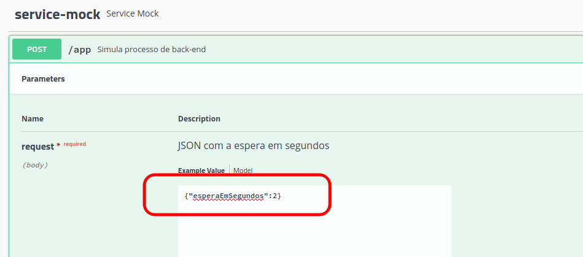

Backend Mock
======================

Simula um backend rápido ou lento. 

Interessante uso para testar circuit breaker de API Gateways.

Descrição
---------

O servidor sobe na porta 9090 e pode ser chamado pela URL http://localhost:9090/swagger-ui.html 
para a interface swagger para testar a API.



Esse serviço pode ser usado facilmente para simular um backend lento:

```
{"esperaEmSegundos":300}
```

### Para subir o servidor

```
git clone https://github.com/boaglio/backend-mock.git
cd backend-mock
mvn spring-boot:run
```

Para rodar em outra porta HTTP:

```
mvn spring-boot:run --server.port=20000
```
